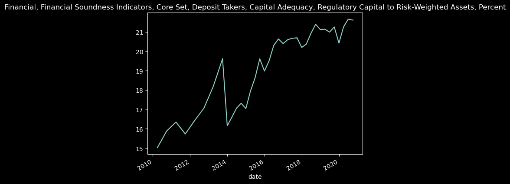

## IMF API

A simple python implementation of the IMF api that allows one to request data from a variety of datasets.

### **Usage:**
```python
from IMF_api import IMF_API
IFS = IMF_API(database='IFS')
IFS.get_indicators(indicators=['EREER_IX'], countries=['United Kingdom'], 
                  startYear=2000, endYear=2020, frequency='Q', sleep_time=2)
```

### **Example:**
```python
import pandas as pd
import matplotlib.pyplot as plt
from IMF_api import IMF_API
```


```python
IFS_api = IMF_API('IFS')
countries = ['Russian Federation', 'United Kingdom', 'Canada']
```


```python
for country in countries:
    print(IFS_api.get_country_code(country))
```
    RU
    GB
    CA


```python
FSI_api = IMF_API('FSI')
search = 'capital risk'
FSI_api.indicator_search(search)
```


<div>
<style scoped>
    .dataframe tbody tr th:only-of-type {
        vertical-align: middle;
    }

    .dataframe tbody tr th {
        vertical-align: top;
    }

    .dataframe thead th {
        text-align: right;
    }
</style>
<table border="1" class="dataframe">
  <thead>
    <tr style="text-align: right;">
      <th></th>
      <th>@value</th>
      <th>#text</th>
    </tr>
  </thead>
  <tbody>
    <tr>
      <th>0</th>
      <td>FSKRC_PT</td>
      <td>Financial, Financial Soundness Indicators, Cor...</td>
    </tr>
    <tr>
      <th>1</th>
      <td>FSDKRC_EUR</td>
      <td>Financial, Financial Soundness Indicators, Cor...</td>
    </tr>
    <tr>
      <th>2</th>
      <td>FSDKRC_XDC</td>
      <td>Financial, Financial Soundness Indicators, Cor...</td>
    </tr>
    <tr>
      <th>3</th>
      <td>FSDKRC_USD</td>
      <td>Financial, Financial Soundness Indicators, Cor...</td>
    </tr>
    <tr>
      <th>4</th>
      <td>FSKRTC_PT</td>
      <td>Financial, Financial Soundness Indicators, Cor...</td>
    </tr>
    <tr>
      <th>5</th>
      <td>FSDKRTC_EUR</td>
      <td>Financial, Financial Soundness Indicators, Cor...</td>
    </tr>
    <tr>
      <th>6</th>
      <td>FSDKRTC_XDC</td>
      <td>Financial, Financial Soundness Indicators, Cor...</td>
    </tr>
    <tr>
      <th>7</th>
      <td>FSDKRTC_USD</td>
      <td>Financial, Financial Soundness Indicators, Cor...</td>
    </tr>
    <tr>
      <th>8</th>
      <td>FSDSNO_EUR</td>
      <td>Financial, Financial Soundness Indicators, Cor...</td>
    </tr>
    <tr>
      <th>9</th>
      <td>FSDSNO_XDC</td>
      <td>Financial, Financial Soundness Indicators, Cor...</td>
    </tr>
    <tr>
      <th>10</th>
      <td>FSDSNO_USD</td>
      <td>Financial, Financial Soundness Indicators, Cor...</td>
    </tr>
    <tr>
      <th>11</th>
      <td>FSSNO_PT</td>
      <td>Financial, Financial Soundness Indicators, Cor...</td>
    </tr>
  </tbody>
</table>
</div>


```python
results = FSI_api.search_data_availability(search, countries, 2000, 2020, 'Q', sleep_time=1.5)
results[results['data_availability'] != 'N/A']
```

<div>
<style scoped>
    .dataframe tbody tr th:only-of-type {
        vertical-align: middle;
    }

    .dataframe tbody tr th {
        vertical-align: top;
    }

    .dataframe thead th {
        text-align: right;
    }
</style>
<table border="1" class="dataframe">
  <thead>
    <tr style="text-align: right;">
      <th></th>
      <th>@value</th>
      <th>#text</th>
      <th>country</th>
      <th>data_availability</th>
    </tr>
  </thead>
  <tbody>
    <tr>
      <th>0</th>
      <td>FSKRC_PT</td>
      <td>Financial, Financial Soundness Indicators, Cor...</td>
      <td>Russian Federation</td>
      <td>2008-2020</td>
    </tr>
    <tr>
      <th>1</th>
      <td>FSKRC_PT</td>
      <td>Financial, Financial Soundness Indicators, Cor...</td>
      <td>United Kingdom</td>
      <td>2008-2020</td>
    </tr>
    <tr>
      <th>2</th>
      <td>FSKRC_PT</td>
      <td>Financial, Financial Soundness Indicators, Cor...</td>
      <td>Canada</td>
      <td>2005-2020</td>
    </tr>
    <tr>
      <th>6</th>
      <td>FSDKRC_XDC</td>
      <td>Financial, Financial Soundness Indicators, Cor...</td>
      <td>Russian Federation</td>
      <td>2008-2020</td>
    </tr>
    <tr>
      <th>7</th>
      <td>FSDKRC_XDC</td>
      <td>Financial, Financial Soundness Indicators, Cor...</td>
      <td>United Kingdom</td>
      <td>2008-2020</td>
    </tr>
    <tr>
      <th>8</th>
      <td>FSDKRC_XDC</td>
      <td>Financial, Financial Soundness Indicators, Cor...</td>
      <td>Canada</td>
      <td>2005-2020</td>
    </tr>
    <tr>
      <th>12</th>
      <td>FSKRTC_PT</td>
      <td>Financial, Financial Soundness Indicators, Cor...</td>
      <td>Russian Federation</td>
      <td>2008-2020</td>
    </tr>
    <tr>
      <th>13</th>
      <td>FSKRTC_PT</td>
      <td>Financial, Financial Soundness Indicators, Cor...</td>
      <td>United Kingdom</td>
      <td>2008-2020</td>
    </tr>
    <tr>
      <th>14</th>
      <td>FSKRTC_PT</td>
      <td>Financial, Financial Soundness Indicators, Cor...</td>
      <td>Canada</td>
      <td>2005-2020</td>
    </tr>
    <tr>
      <th>18</th>
      <td>FSDKRTC_XDC</td>
      <td>Financial, Financial Soundness Indicators, Cor...</td>
      <td>Russian Federation</td>
      <td>2008-2020</td>
    </tr>
    <tr>
      <th>19</th>
      <td>FSDKRTC_XDC</td>
      <td>Financial, Financial Soundness Indicators, Cor...</td>
      <td>United Kingdom</td>
      <td>2008-2020</td>
    </tr>
    <tr>
      <th>20</th>
      <td>FSDKRTC_XDC</td>
      <td>Financial, Financial Soundness Indicators, Cor...</td>
      <td>Canada</td>
      <td>2005-2020</td>
    </tr>
    <tr>
      <th>27</th>
      <td>FSDSNO_XDC</td>
      <td>Financial, Financial Soundness Indicators, Cor...</td>
      <td>Russian Federation</td>
      <td>2008-2020</td>
    </tr>
    <tr>
      <th>28</th>
      <td>FSDSNO_XDC</td>
      <td>Financial, Financial Soundness Indicators, Cor...</td>
      <td>United Kingdom</td>
      <td>2008-2020</td>
    </tr>
    <tr>
      <th>33</th>
      <td>FSSNO_PT</td>
      <td>Financial, Financial Soundness Indicators, Cor...</td>
      <td>Russian Federation</td>
      <td>2008-2020</td>
    </tr>
    <tr>
      <th>34</th>
      <td>FSSNO_PT</td>
      <td>Financial, Financial Soundness Indicators, Cor...</td>
      <td>United Kingdom</td>
      <td>2008-2020</td>
    </tr>
  </tbody>
</table>
</div>


```python
IFS_api = IMF_API('IFS')
search = 'exchange real effective'
IFS_api.indicator_search(search)
```


<div>
<style scoped>
    .dataframe tbody tr th:only-of-type {
        vertical-align: middle;
    }

    .dataframe tbody tr th {
        vertical-align: top;
    }

    .dataframe thead th {
        text-align: right;
    }
</style>
<table border="1" class="dataframe">
  <thead>
    <tr style="text-align: right;">
      <th></th>
      <th>@value</th>
      <th>#text</th>
    </tr>
  </thead>
  <tbody>
    <tr>
      <th>0</th>
      <td>EREER_IX</td>
      <td>Exchange Rates, Real Effective Exchange Rate b...</td>
    </tr>
    <tr>
      <th>1</th>
      <td>EREER_PC_CP_A_PT</td>
      <td>Exchange Rates, Real Effective Exchange Rate b...</td>
    </tr>
    <tr>
      <th>2</th>
      <td>EREER_ULC_IX</td>
      <td>Exchange Rates, Real Effective Exchange Rate b...</td>
    </tr>
  </tbody>
</table>
</div>


```python
results = IFS_api.search_data_availability(search, countries, 2000, 2020, 'Q', sleep_time=1.5)
results[results['data_availability'] != 'N/A']
```

<div>
<style scoped>
    .dataframe tbody tr th:only-of-type {
        vertical-align: middle;
    }

    .dataframe tbody tr th {
        vertical-align: top;
    }

    .dataframe thead th {
        text-align: right;
    }
</style>
<table border="1" class="dataframe">
  <thead>
    <tr style="text-align: right;">
      <th></th>
      <th>@value</th>
      <th>#text</th>
      <th>country</th>
      <th>data_availability</th>
    </tr>
  </thead>
  <tbody>
    <tr>
      <th>0</th>
      <td>EREER_IX</td>
      <td>Exchange Rates, Real Effective Exchange Rate b...</td>
      <td>Russian Federation</td>
      <td>2000-2020</td>
    </tr>
    <tr>
      <th>1</th>
      <td>EREER_IX</td>
      <td>Exchange Rates, Real Effective Exchange Rate b...</td>
      <td>United Kingdom</td>
      <td>2000-2020</td>
    </tr>
    <tr>
      <th>2</th>
      <td>EREER_IX</td>
      <td>Exchange Rates, Real Effective Exchange Rate b...</td>
      <td>Canada</td>
      <td>2000-2020</td>
    </tr>
    <tr>
      <th>7</th>
      <td>EREER_ULC_IX</td>
      <td>Exchange Rates, Real Effective Exchange Rate b...</td>
      <td>United Kingdom</td>
      <td>2000-2020</td>
    </tr>
    <tr>
      <th>8</th>
      <td>EREER_ULC_IX</td>
      <td>Exchange Rates, Real Effective Exchange Rate b...</td>
      <td>Canada</td>
      <td>2000-2020</td>
    </tr>
  </tbody>
</table>
</div>


```python
indicators_FSI = ['FSKRC_PT', 'FSKRTC_PT']
indicators_IFS = ['EREER_IX']
```


```python
for indicator in indicators_FSI:
    print(FSI_api.get_indicator_name(indicator))

for indicator in indicators_IFS:
    print(IFS_api.get_indicator_name(indicator))
```

    Financial, Financial Soundness Indicators, Core Set, Deposit Takers, Capital Adequacy, Regulatory Capital to Risk-Weighted Assets, Percent
    Financial, Financial Soundness Indicators, Core Set, Deposit Takers, Capital Adequacy, Regulatory Tier 1 Capital to Risk-Weighted Assets, Percent
    Exchange Rates, Real Effective Exchange Rate based on Consumer Price Index, Index

```python
uk_FSKRC_PT = FSI_api.get_series(indicator='FSKRC_PT', country='United Kingdom', startYear=2010, endYear=2020, frequency='Q', sleep_time=3)
uk_FSKRC_PT.plot()
plt.title(uk_FSKRC_PT.name)
plt.show()
```




```python
IFS_api = IMF_API('IFS')
FSI_api = IMF_API('FSI')

data_IFS = IFS_api.get_indicators(indicators_IFS, countries, 2010, 2020, 'Q', sleep_time=2)
data_FSI = FSI_api.get_indicators(indicators_FSI, countries, 2010, 2020, 'Q', sleep_time=2)
dataset = pd.merge(data_FSI, data_IFS, how='outer', on=['Date', "country"]).sort_index()
```

```python
dataset
```

<div>
<style scoped>
    .dataframe tbody tr th:only-of-type {
        vertical-align: middle;
    }

    .dataframe tbody tr th {
        vertical-align: top;
    }

    .dataframe thead th {
        text-align: right;
    }
</style>
<table border="1" class="dataframe">
  <thead>
    <tr style="text-align: right;">
      <th></th>
      <th>Regulatory Capital to Risk-Weighted Assets, Percent</th>
      <th>Regulatory Tier 1 Capital to Risk-Weighted Assets, Percent</th>
      <th>country</th>
      <th>Real Effective Exchange Rate based on Consumer Price Index, Index</th>
    </tr>
    <tr>
      <th>Date</th>
      <th></th>
      <th></th>
      <th></th>
      <th></th>
    </tr>
  </thead>
  <tbody>
    <tr>
      <th>2010-01-01</th>
      <td>20.483177</td>
      <td>14.606693</td>
      <td>Russian Federation</td>
      <td>98.812598</td>
    </tr>
    <tr>
      <th>2010-01-01</th>
      <td>NaN</td>
      <td>NaN</td>
      <td>United Kingdom</td>
      <td>99.060989</td>
    </tr>
    <tr>
      <th>2010-01-01</th>
      <td>14.816699</td>
      <td>12.414406</td>
      <td>Canada</td>
      <td>98.761962</td>
    </tr>
    <tr>
      <th>2010-04-01</th>
      <td>18.851378</td>
      <td>14.072243</td>
      <td>Russian Federation</td>
      <td>102.486504</td>
    </tr>
    <tr>
      <th>2010-04-01</th>
      <td>15.027093</td>
      <td>12.351023</td>
      <td>United Kingdom</td>
      <td>98.863391</td>
    </tr>
    <tr>
      <th>...</th>
      <td>...</td>
      <td>...</td>
      <td>...</td>
      <td>...</td>
    </tr>
    <tr>
      <th>2020-07-01</th>
      <td>15.702111</td>
      <td>13.457219</td>
      <td>Canada</td>
      <td>80.917568</td>
    </tr>
    <tr>
      <th>2020-07-01</th>
      <td>12.735491</td>
      <td>10.371338</td>
      <td>Russian Federation</td>
      <td>78.200748</td>
    </tr>
    <tr>
      <th>2020-10-01</th>
      <td>21.568759</td>
      <td>18.489046</td>
      <td>United Kingdom</td>
      <td>98.277274</td>
    </tr>
    <tr>
      <th>2020-10-01</th>
      <td>16.095553</td>
      <td>13.933574</td>
      <td>Canada</td>
      <td>81.936053</td>
    </tr>
    <tr>
      <th>2020-10-01</th>
      <td>12.467320</td>
      <td>9.703171</td>
      <td>Russian Federation</td>
      <td>74.794647</td>
    </tr>
  </tbody>
</table>
<p>132 rows × 4 columns</p>
</div>


```python
dataset.to_csv('./data/imf_dataset.csv')
```
